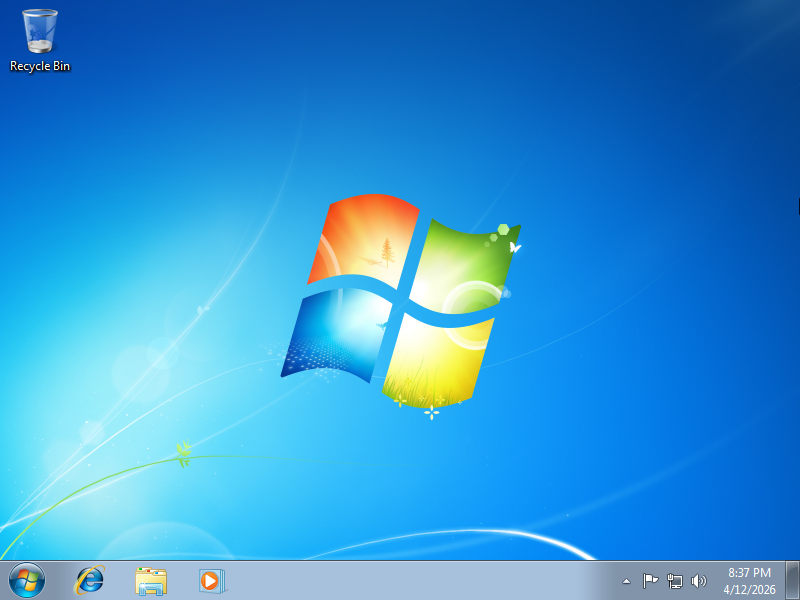
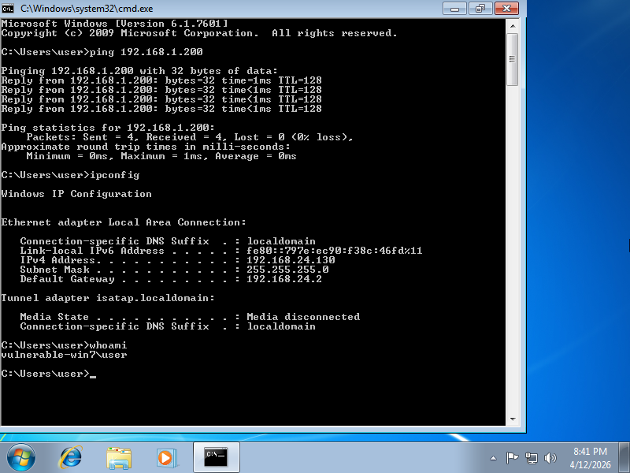
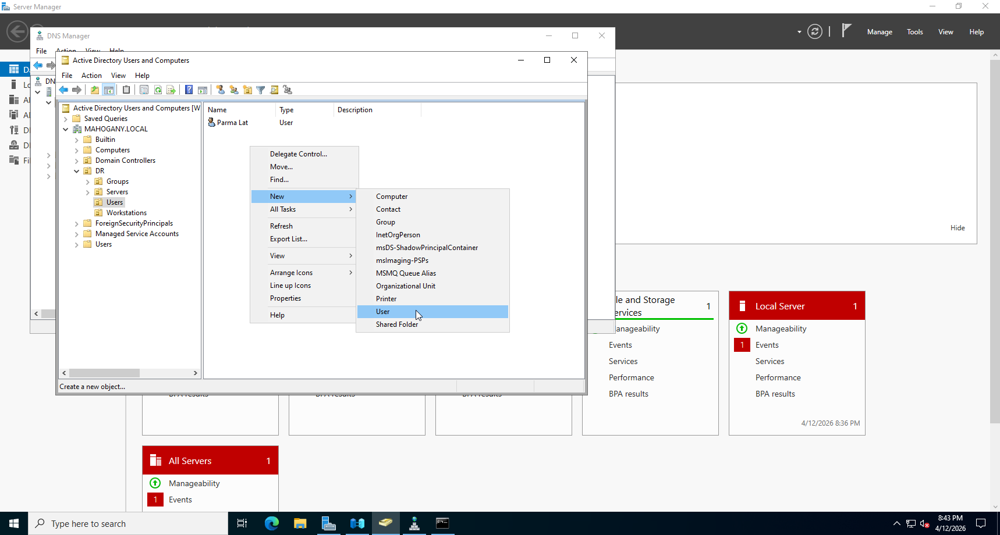
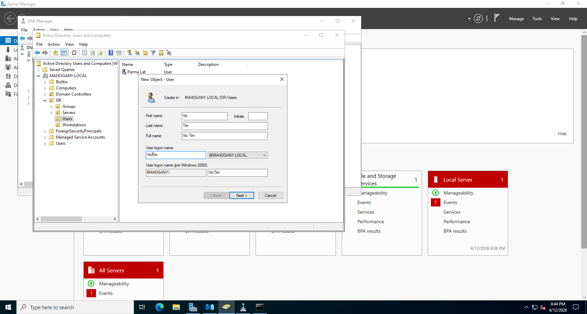
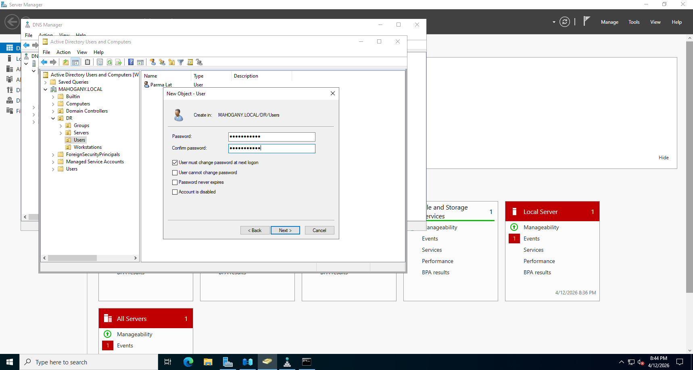
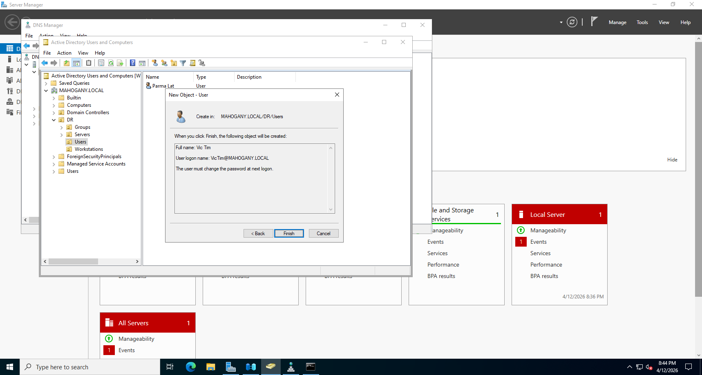
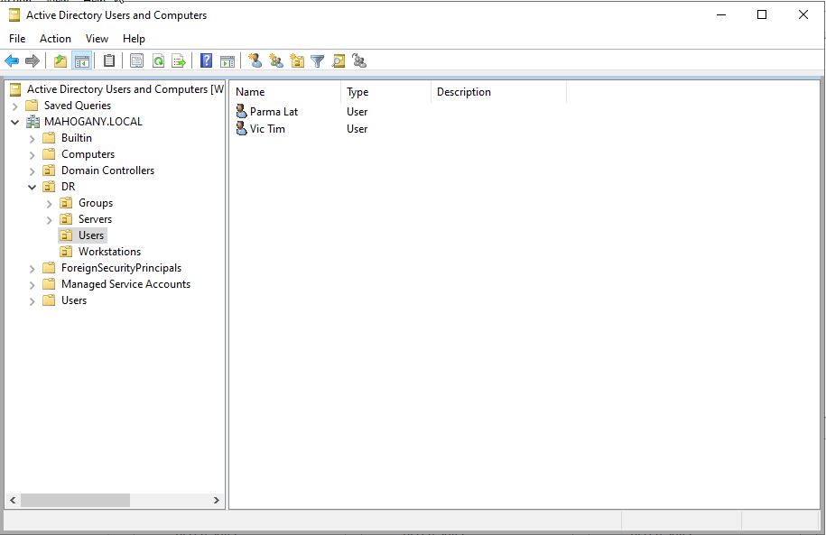
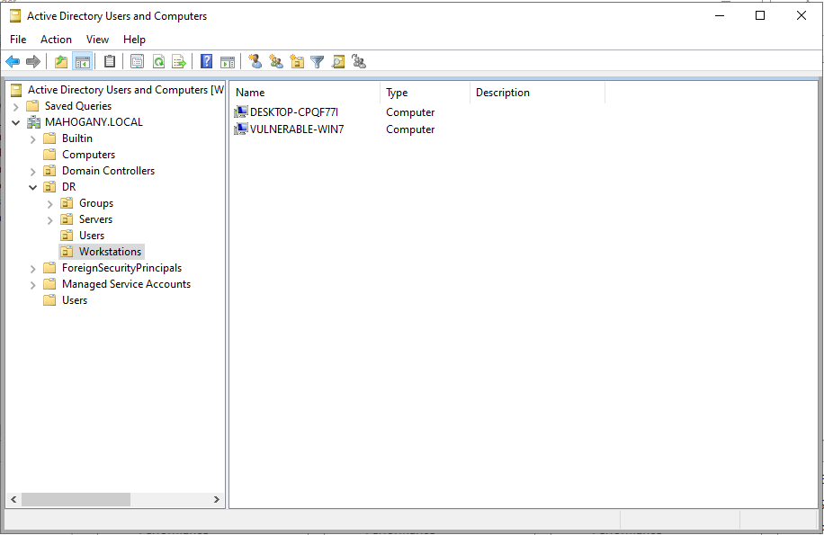
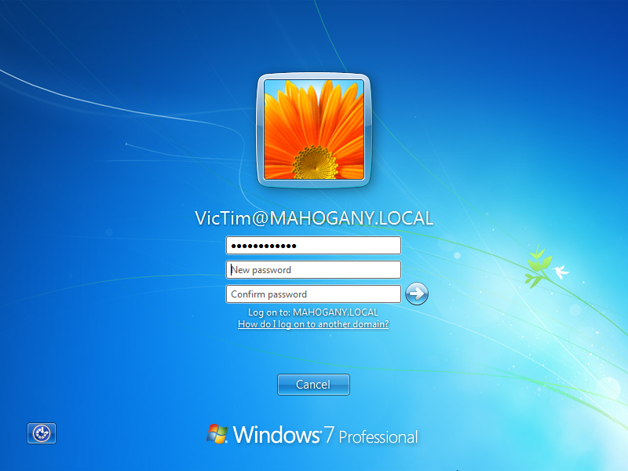
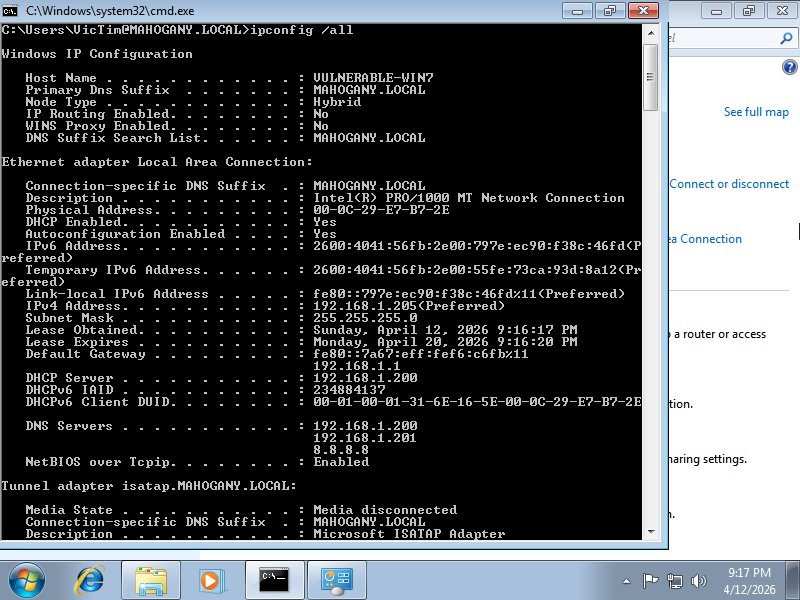

# Adding new user/client to the environment

## Overview
A new user has been added to Mahogany Corp, his name is Vic Tim, he will work alonside ParmaLat.

## Technologies Used
- VMWare Workstation Pro 17
- Windows Server 2022
- Active Directory Domain Services (AD DS)
- DNS Server
- DHCP Server
- Windows 7 sp1 Client

## Screenshots
### A new fresh Win 7 machine for the new user 

Default Network Configuration after install

### On Windows Server, creating user

User Details

Set Up Initial Password (To be changed on next logon)

User Created!

#### User on OU:

#### Machine on OU:

### First Login after joining domain

### Network configuration after joining domain, showing DNS Prefix, DHCP Server and being assigned IP from DHCP pool.

## Troubleshooting 
 * As this is a virtualized lab, hosted in VMWware Workstation Pro, in order for the DHCP server to work, I had to fix the rogue DHCP server error. The solve this problem, we have to "Virtual Netowrk Editor" on VMWare and desactivate "Use local DHCP service to distribute IP addresses to VMs" option. And also make sure that all VM's are in the same network interface.
   

